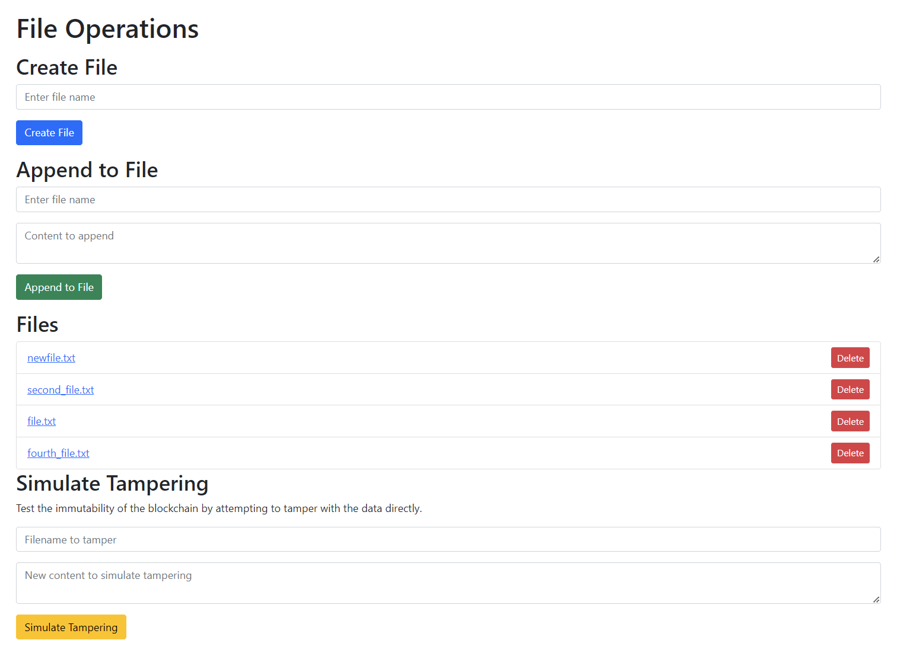

# A Series of Tubes

## [CSEE 4119 Spring 2024, Class Project](https://classroom.github.com/a/-Lgd7v9y)

| Name | UNI | Github |
| --- | --- | --- |
| Yiming Li | yl5436 | Anon11110 |
| Cristopher Marte Marte | cjm2301 | cmartema |
| Ryan Najac | rdn2108 | rdnajac |
| Jason P'ng | jp4361 | jpngfile |


## Project Description

A Series of Tubes is a decentralized file storage implemented as a peer-to-peer blockchain network.
The blockchain implementation provides high availability of data and automatic validation of data integrity without relying on a single authority. Additionally, we provide a graphical web interface for interacting with the filesystem.



## Goals

Four major goals:

1. Implementation of a peer-to-peer network
    - [x] 1 tracker and at least 3 clients/peers (all on Google VMs).
    - [x] Tracker maintains a list of peers which is updated when a peer joins or leaves the network.
    - [x] Every peer should be aware of any updates made to the list.

2. Implementation of a basic blockchain, where each node:
    - [x] maintains a copy of the blockchain.
    - [x] can create a valid block through mining.
    - [x] can broadcast the block to other peers.
    - [x] can verify a block and add it to the local blockchain.
    - [x] can handle forks.

3. Implementation of the file storage system:

    - File Management Functions:
      - [x] create
      - [x] append
      - [x] delete

    - Web Interface:
      - [x] Flask
      - [x] demo

    - Blockchain Integration:
      - [x] record transactions as blocks
      - [x] respond to commands

4. Demonstration of how blockchain is resilient to invalid transactions and modifications made to blocks.
   - [x] DESIGN.md describes the blockchain design, p2p protocol, and file storage system.
   - [x] TESTING.md describes the set of tests run to demonstrate the resilience of blockchain.

## Installation

1. Clone the repository.
2. Run `virtualenv venv`
3. Run `source venv/bin/activate`
4. Run `pip install -r requirements.txt`
5. Run `export PYTHONPATH=$PYTHONPATH:$(pwd)` to add the current directory to your `PYTHONPATH`.

Alternatively, you can run copy and paste the following one-liners after cloning the repository to `~/project-a-series-of-tubes`:

```sh
# prerequisites on Google base VM for CS4119
sudo apt update && sudo apt upgrade -y && sudo apt install python3-pip python3.8-venv

# set the virtual environment path and install the requirements
(cd ~/project-a-series-of-tubes && python3 -m venv venv && source venv/bin/activate && pip install -r requirements.txt && export PYTHONPATH=$PYTHONPATH:$(pwd))
```

## Testing

To run the tests by executing the following command:

``` sh
pytest tests
```

Additional details can be found in the [TESTING.md](TESTING.md) file.

## References

The architecture for the distributed file system was inspired by this article: https://hackernoon.com/blockchain-as-a-distributed-file-system-how-would-it-work-ca1f3y3l