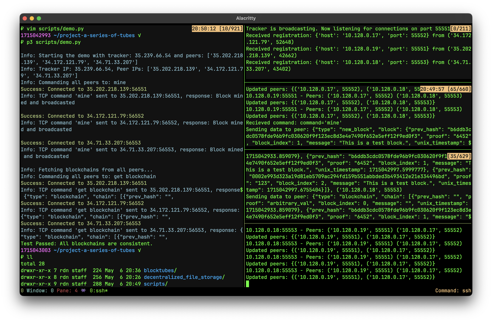

# A Series of Tubes Testing Doc

demoV0: `scripts/run_file_storage.sh` will perform a smoke test on local machine



1. run `scripts/init_tmux.sh` to setup the tmux session
2. run `scripts/demo.sh` to start the tracker and peer nodes in the provided VMs

> note this was set up using my own VMs, so you will need to change the IP addresses

## `test_app.py`

### Overview

Starts a tracker server and multiple peer nodes, then sends commands to these nodes to simulate blockchain operations. The script verifies the consistency of the blockchain across all nodes in the network.

1. Initializes the tracker server and peer nodes.
2. Waits for all peers to register with the tracker.
3. Blocks are mined by each peer node.
    - Each peer sends a "mine" command to the tracker.
    - The tracker forwards the command to each peer.
    - Each peer mines a block and updates its blockchain.
4. The tracker retrieves the blockchain from each peer and checks for consistency across all nodes.

Update: instead of using `subprocess.Popen`, and hardcoding command-line arguments to start the tracker and peer nodes in different subprocesses, we can use now import `blocktubes` and call functions directly for use in pthreads for local testing.

``` python
from blocktubes.peer import Peer
from blocktubes.tracker import Tracker
```

## `demomanager.py` according to ChatGPT

The `demomanager.py` script is designed to facilitate the deployment, management, and testing of a distributed blockchain network. It automates tasks like starting server and peer nodes, sending commands for blockchain operations, and validating the consistency of the blockchain across multiple nodes. It includes detailed logging for tracking the execution flow and potential issues during the process.

### Configuration

- **Network Setup**: Configures ports, IP addresses, and file paths necessary to control the network of VMs hosting the blockchain.
- **SSH Management**: Uses Paramiko to handle SSH connections for remote command execution on VMs.

### class `DemoManager`

- **Purpose**: Manages SSH connections and command executions across a network of VMs.
- **Key Methods**:
  - `init_tracker` and `init_peers`: Start the tracker and peer nodes respectively.
  - `exec_command`: Executes specified commands on remote hosts using SSH.
  - `send_tcp_command_to_peers`: Sends TCP commands to peer nodes to perform actions like mining blocks.
  - `get_blockchains`: Retrieves blockchain data from each node to check consistency.

### Testing Workflow

1. **Initialize Network**: Set up the tracker and peer nodes using their respective scripts.
2. **Command Execution**: Send 'mine' commands to peer nodes to simulate blockchain operations.
3. **Validation**: Retrieve and compare blockchain data from each node to ensure consistency across the network.

## `demo.sh` according to ChatGPT

The `demo.sh` script automates the process of setting up, running, and managing a distributed blockchain network for testing. This script utilizes tmux for managing multiple sessions and SSH for remote operations.

### Features

- **Script Setup**: Ensures that all previous tmux sessions are closed and sets up a new session divided into multiple panes for parallel operations.
- **SSH into VMs**: Connects to a list of nodes via SSH. It is configured to use a specific SSH key and a Columbia UNI for authentication.
- **Update Repositories**: Performs a `git stash` and `git pull` operation on all nodes to ensure the latest codebase is being used.
- **Start Tracker**: Runs the tracker Python script on the first node.
- **Start Peers**: Initiates peer Python scripts on other nodes, connecting them to the tracker.
- **Send Commands**: Sends commands to peers from the local machine to initiate blockchain operations, such as mining.

### Key Components

- **tmux**: Used for managing multiple command-line sessions within a single window.
- **SSH Configuration**: Utilizes specific user credentials and SSH key for secure connection.
- **Script Commands**:
  - `reset`: Resets the tmux environment to prevent overlap with previous sessions.
  - `ssh_into_vms`: Initiates SSH connections to all nodes.
  - `update`: Ensures all nodes are synchronized with the latest repository changes.
  - `start_tracker`: Starts the blockchain tracker on the designated host.
  - `start_peers`: Starts peer nodes that connect to the tracker and participate in the blockchain network.
  - `send_cmd_to_peers`: Facilitates the sending of blockchain-specific commands like "mine" to peer nodes.

### Execution Flow

1. **Setup**: Resets tmux environment and establishes a new session with multiple panes.
2. **Remote Operations**: SSH into each virtual machine, update the codebase.
3. **Network Initialization**: Start the tracker and peer services.
4. **Operational Commands**: Send operational commands to peers to simulate blockchain activities.

## ## Manually Running the Test

If the demo script does not work, you can follow these steps to run the blockchain network.

### Environment Setup

1. Check if you have any processes using the following ports: `[60000, 50110, 50111, 50112, 5001, 5002, 5003]`. If any exist, either replace the port with an unused one or kill the running process
2. Confirm you have the root of the repo in your `PYTHONPATH`. i.e. `export PYTHONPATH=$PYTHONPATH:.`
3. Make sure you have `Flask` installed. i.e. `pip install -r requirements.txt`

### Running the Network

For each of the processes, run it in a separate terminal tab.

1. Run the tracker

```
$ python -m blocktubes.tracker 60000
Tracker is broadcasting. Now listening for connections on port 60000...
```

2. Run one node of the distributed file system

```
export PEER_PORT=50110
python -m decentralized_file_storage.app 5001
```

3. Run another node of the distributed file system

```
export PEER_PORT=50111
python -m decentralized_file_storage.app 5002
```

4. Run a third node of the distributed file system

```
export PEER_PORT=50112
python -m decentralized_file_storage.app 5003
```

You can now see the web page to interact with the file system on `localhost:5001`, `localhost:5002`, and `localhost:5003`
